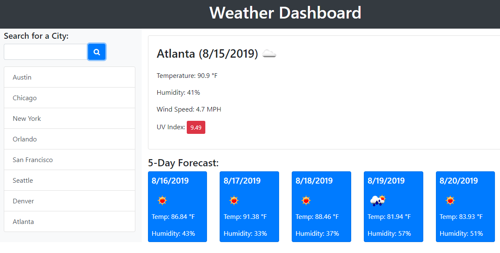

# Weather Dashboard

## 🌟 Enhanced Weather Dashboard Application

A beautifully designed, responsive weather dashboard that provides real-time weather information and 5-day forecasts for any city worldwide.

## ✨ Features

- **Modern UI Design**: Clean, gradient-based interface with smooth animations
- **Real-time Weather Data**: Current conditions including temperature, humidity, wind speed, and UV index
- **5-Day Forecast**: Detailed forecast with icons for each day
- **Search History**: Automatically saves recent searches (up to 5 cities)
- **Responsive Design**: Works perfectly on desktop, tablet, and mobile devices
- **UV Index Color Coding**: Visual indicators for UV levels (low, moderate, high, very high, extreme)
- **Local Storage**: Saves search history between sessions

## 🚀 How to Use

1. Open `index.html` in your web browser
2. Enter a city name in the search box
3. Click the search button or press Enter
4. View current weather and 5-day forecast
5. Click on recent searches to quickly view previously searched cities

## 🛠️ Technologies Used

- **HTML5** - Semantic markup and structure
- **CSS3** - Modern styling with gradients, flexbox, and animations
- **JavaScript (jQuery)** - Interactive functionality and API integration
- **Bootstrap 4.5** - Responsive grid system and components
- **Font Awesome** - Icons for better visual representation
- **Moment.js** - Date and time formatting
- **OpenWeatherMap API** - Weather data source
  - **Note**: The included API key may be expired. The app includes fallback demo mode.

## 🔑 API Key Note

The current OpenWeatherMap API key in `script.js` (`4140034c75a10c75298c4be081943fce`) appears to be expired or invalid. The application includes:

1. **Demo Mode**: When API fails, the app switches to demo mode with sample data
2. **Error Handling**: Clear messages when API issues occur
3. **Fallback Data**: Realistic mock weather data for testing

**To use real weather data:**
1. Get a free API key from [OpenWeatherMap](https://openweathermap.org/api)
2. Replace the `API_KEY` constant in `script.js` with your new key
3. The app will automatically use real data when a valid key is provided

## 📁 Project Structure

```
my-history/
├── index.html          # Main HTML file
├── style.css           # Custom CSS styles
├── script.js           # JavaScript functionality
├── README.md           # Project documentation
└── 06-server-side-apis-homework-demo.png  # Demo screenshot
```

## 🔧 Code Improvements Made

### HTML Fixes:
- ✅ Fixed duplicate jQuery library loading
- ✅ Resolved duplicate ID usage (`cityName`)
- ✅ Corrected invalid HTML structure (double `class` attributes)
- ✅ Fixed self-closing input tag
- ✅ Added proper Bootstrap 4.5 structure with responsive grid
- ✅ Added semantic HTML elements
- ✅ Enhanced accessibility with ARIA labels

### CSS Enhancements:
- ✅ Modern gradient backgrounds
- ✅ Smooth animations and hover effects
- ✅ Responsive design for all screen sizes
- ✅ Card-based layout with shadows
- ✅ Color-coded UV index display
- ✅ Improved typography with Google Fonts

### JavaScript Improvements:
- ✅ Complete rewrite with jQuery for cleaner code
- ✅ Proper API integration with error handling
- ✅ Local storage for search history
- ✅ Loading states and user feedback
- ✅ UV index color coding based on severity
- ✅ 5-day forecast with proper date formatting

## 📱 Responsive Design

The dashboard is fully responsive and works on:
- **Desktop** (1200px+): Full layout with side-by-side columns
- **Tablet** (768px-1199px): Adjusted column layout
- **Mobile** (<768px): Stacked columns for optimal viewing

## 🌈 Visual Features

- Gradient backgrounds for cards and headers
- Smooth hover animations on interactive elements
- Weather icons from OpenWeatherMap
- Color-coded metrics for better readability
- Modern card design with rounded corners and shadows

## 🎯 User Story & Acceptance Criteria

**AS A traveler**  
**I WANT to see the weather outlook for multiple cities**  
**SO THAT I can plan a trip accordingly**

✅ **GIVEN** a weather dashboard with form inputs  
✅ **WHEN** I search for a city  
✅ **THEN** I am presented with current and future conditions for that city and that city is added to the search history  

✅ **WHEN** I view current weather conditions for that city  
✅ **THEN** I am presented with the city name, the date, an icon representation of weather conditions, the temperature, the humidity, the wind speed, and the UV index  

✅ **WHEN** I view the UV index  
✅ **THEN** I am presented with a color that indicates whether the conditions are favorable, moderate, or severe  

✅ **WHEN** I view future weather conditions for that city  
✅ **THEN** I am presented with a 5-day forecast that displays the date, an icon representation of weather conditions, the temperature, and the humidity  

✅ **WHEN** I click on a city in the search history  
✅ **THEN** I am again presented with current and future conditions for that city  

✅ **WHEN** I open the weather dashboard  
✅ **THEN** I am presented with the last searched city forecast  

## 📸 Preview



## 📄 License

This project is open source and available for educational purposes.

## 🙏 Acknowledgments

- **OpenWeatherMap** for providing the weather API
- **Bootstrap** for responsive components
- **Font Awesome** for beautiful icons
- **jQuery** for simplified JavaScript functionality